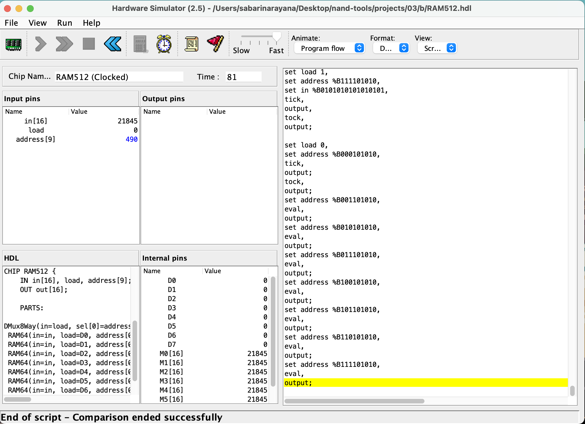
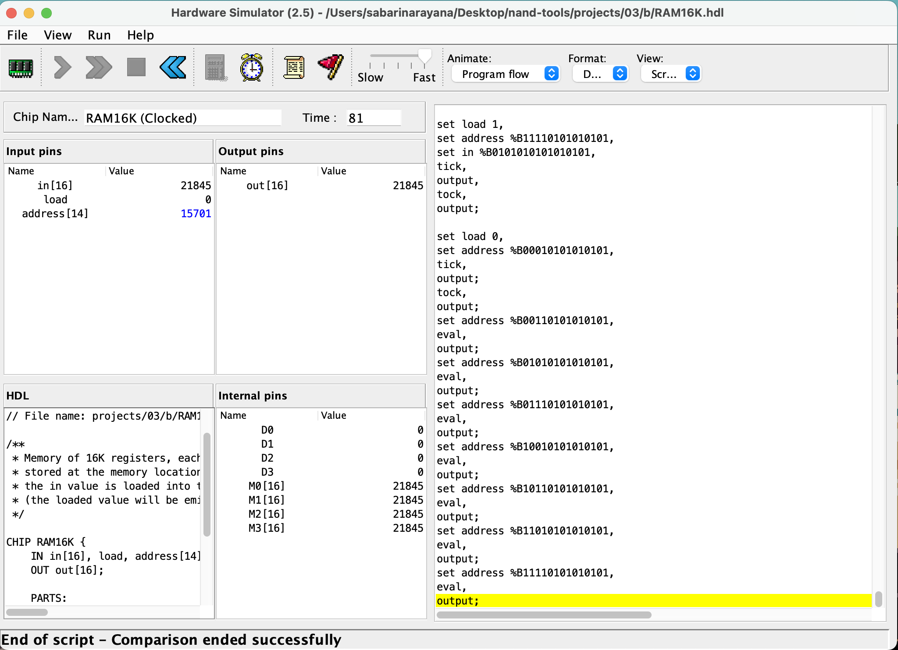
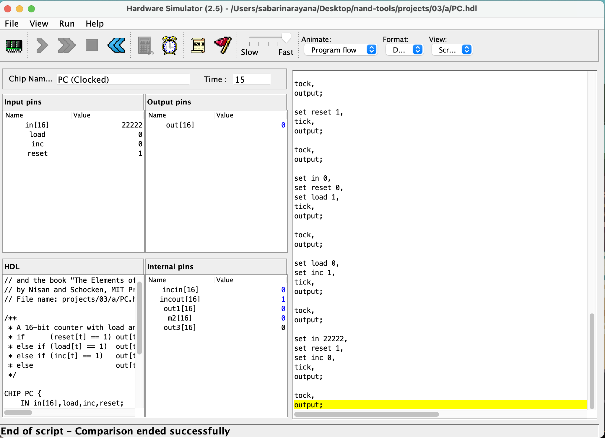

RAM512

RAM4K

RAM16K

PC

meeting date: 21-sep-2023
meeting time: 5:00 PM

Attendees:
1.anil
2.sabari narayana

Agenda:
Disscuss how can we make Sequential Logic and Flipflops / Memory units and counters more engaging and understandable

Meeting Discussion:

Discussed whats the problem with this concepts and decided to create a student contribution lesson for each topics which should be more engaging and understandable.

Next Step:
Tmr we will come with a lesson for sequential logic and flipflops and review it.
Create a lesson which make more engaing and understandable and it will be reviewed tmr.

Next meeting :
Date: 22-sep-2023
Time: 5:00 PM
